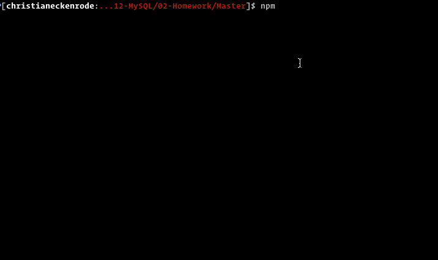

# Unit 12 MySQL Homework: Employee Tracker

Developers are often tasked with creating interfaces that make it easy for non-developers to view and interact with information stored in databases. Often these interfaces are known as **C**ontent **M**anagement **S**ystems. In this homework assignment, your challenge is to architect and build a solution for managing a company's employees using node, inquirer, and MySQL.

## Instructions

Design the following database schema containing three tables:


* **department**:

  * **id** - INT PRIMARY KEY
  * **name** - VARCHAR(30) to hold department name

* **role**:

  * **id** - INT PRIMARY KEY
  * **title** -  VARCHAR(30) to hold role title
  * **salary** -  DECIMAL to hold role salary
  * **department_id** -  INT to hold reference to department role belongs to

* **employee**:

  * **id** - INT PRIMARY KEY
  * **first_name** - VARCHAR(30) to hold employee first name
  * **last_name** - VARCHAR(30) to hold employee last name
  * **role_id** - INT to hold reference to role employee has
  * **manager_id** - INT to hold reference to another employee that manages the employee being Created. This field may be null if the employee has no manager
  
We can frame this challenge as follows:

```
As a business owner
I want to be able to view and manage the departments, roles, and employees in my company
So that I can organize and plan my business
```

How do you deliver this? Here are some guidelines:

* Use the [MySQL](https://www.npmjs.com/package/mysql) NPM package to connect to your MySQL database and perform queries.

* Use [InquirerJs](https://www.npmjs.com/package/inquirer/v/0.2.3) NPM package to interact with the user via the command-line.

* Use [console.table](https://www.npmjs.com/package/console.table) to print MySQL rows to the console. There is a built-in version of `console.table`, but the NPM package formats the data a little better for our purposes.

* You may wish to have a separate file containing functions for performing specific SQL queries you'll need to use. Could a constructor function or a class be helpful for organizing these? ❓ -- what does this even mean?

* You will need to perform a variety of SQL JOINS to complete this assignment, and it's recommended you review the week's activities if you need a refresher on this.



### Hints

* You may wish to include a `seed.sql` file to pre-populate your database. This will make development of individual features much easier.

* Focus on getting the basic functionality completed before working on more advanced features.

* Review the week's activities for a refresher on MySQL.

* Check out [SQL Bolt](https://sqlbolt.com/) for some extra MySQL help.

## Minimum Requirements

* Functional application.

* GitHub repository with a unique name and a README describing the project.

* The command-line application should allow users to:

  * Add departments ❓

  * Add roles ❓
  
  * Add employees ❓

  * View departments ❓
  
  * View roles ❓
  
  * View employees ❓

  * Update employee roles ❓

## Bonus

* The command-line application should allow users to:

  * Update employee managers ❓

  * View employees by manager ❓

  * Delete departments ❓
  
  * Delete roles ❓ 
  
  * Delete employees ❓ 

  * View the total utilized budget of a department -- ie the combined salaries of all employees in that department ❓


**Important**: You will be committing a file that contains your database credentials. Make sure your MySQL password is not used for any other personal accounts, because it will be visible on GitHub. In upcoming lessons, you will learn how to better secure this password, or you can start researching npm packages now that could help you.


## Submission on BCS

You are required to submit the following:

* The URL of the GitHub repository

* A video demonstrating the entirety of the app's functionality 